# Zelda Contribution Graph

Turn your GitHub contribution graph into a classic 8-bit Zelda (NES) adventure. Link walks across your contribution calendar collecting rupees, hearts and cutting bushes, while Octoroks, Moblins, Leevers and Keese patrol the overworld.

The collectibles rotate over time: rupees → hearts → bushes → repeat.

Inspired by [abozanona/pacman-contribution-graph](https://github.com/abozanona/pacman-contribution-graph).

## Preview



## Quick start — one-time generation

```bash
git clone https://github.com/YOUR_GITHUB_USERNAME/zelda-contribution-graph.git
cd zelda-contribution-graph
npm install
npm run build

# Generate with mock data (no token needed)
node dist/cli.js --mock --output preview.svg

# Generate with real GitHub data
export GITHUB_TOKEN=ghp_your_token_here
node dist/cli.js --username YOUR_GITHUB_USERNAME --output zelda.svg
```

A GitHub personal access token with the `read:user` scope works. Create one at [https://github.com/settings/tokens](https://github.com/settings/tokens).

## Use on your GitHub profile

1. Create a repository named exactly the same as your GitHub username (so the repo path is `github.com/YOUR_GITHUB_USERNAME/YOUR_GITHUB_USERNAME`). This is your "profile repo".

2. In that repo, create `.github/workflows/zelda.yml` with the contents of [`examples/workflow.yml`](./examples/workflow.yml), replacing `YOUR_GITHUB_USERNAME` with your handle.

3. Commit and push. The workflow will run on a daily schedule and on manual dispatch, generating fresh SVGs and pushing them to a branch called `output`.

4. Add the snippet from [`examples/README-snippet.md`](./examples/README-snippet.md) to your profile `README.md`.

5. Done — your profile now has an animated 8-bit Zelda graph.

## How it works

- **`src/fetch-contributions.ts`** calls GitHub's GraphQL API and returns a 53×7 contribution grid.
- **`src/sprites.ts`** defines every sprite (Link in 4 directions × 2 walking frames, 4 enemies × 2 frames, 3 rupee tiers, heart and bush) as pixel grids and converts them to SVG `<symbol>`s.
- **`src/game-logic.ts`** builds a zig-zag path that visits every cell, and assigns patrol patterns for each enemy (horizontal for Octorok and Moblin, vertical for Leever, diagonal bounce for Keese).
- **`src/svg-generator.ts`** produces one self-contained animated SVG that uses SMIL (`<animate>`, `<animateTransform>`) so it animates correctly when embedded in a GitHub README.
- **Three phases** cycle over time: all rupees, then all hearts, then all bushes. Each phase is one full traversal of the grid; after 3 phases, the animation loops.

## Customization

CLI flags:

```
--username <name>      GitHub username (required unless --mock)
--token <token>        GitHub PAT (or set GITHUB_TOKEN env)
--output <path>        Output SVG path
--theme <dark|light>   Color theme (default dark)
--duration <seconds>   Total loop length (default 90)
--mock                 Use deterministic mock data (no API call)
```

To change enemy placement, edit `createEnemies` in `src/game-logic.ts`.
To add or swap collectibles, edit `src/sprites.ts` (sprites are 16×16 grids of single-character color codes) and adjust `collectibleForPhase` in `src/game-logic.ts`.

## Rendering notes

The output SVG uses SMIL animations, which are supported by the GitHub SVG renderer and by Chrome/Safari/Firefox when the file is opened directly. Animation stays crisp at any zoom because `shape-rendering="crispEdges"` is set and sprites are pure pixel rects — no bitmap.

## Files

```
zelda-contribution-graph/
├── action.yml              # GitHub Action definition
├── package.json
├── tsconfig.json
├── LICENSE
├── README.md
├── src/
│   ├── cli.ts              # Command-line entry point
│   ├── index.ts            # Programmatic API
│   ├── fetch-contributions.ts
│   ├── game-logic.ts
│   ├── sprites.ts
│   ├── svg-generator.ts
│   └── types.ts
├── examples/
│   ├── workflow.yml        # GitHub Actions workflow template
│   ├── README-snippet.md   # Profile README embed snippet
│   └── preview.svg         # Sample output (mock data)
└── .github/workflows/
```

## Legal

Not affiliated with Nintendo. The Legend of Zelda and Link are trademarks of Nintendo Co., Ltd. Sprites in this project are original pixel art inspired by the 1986 NES title; no official Nintendo assets are redistributed.

MIT licensed — see [LICENSE](./LICENSE).
# zelda-contribution-graph
